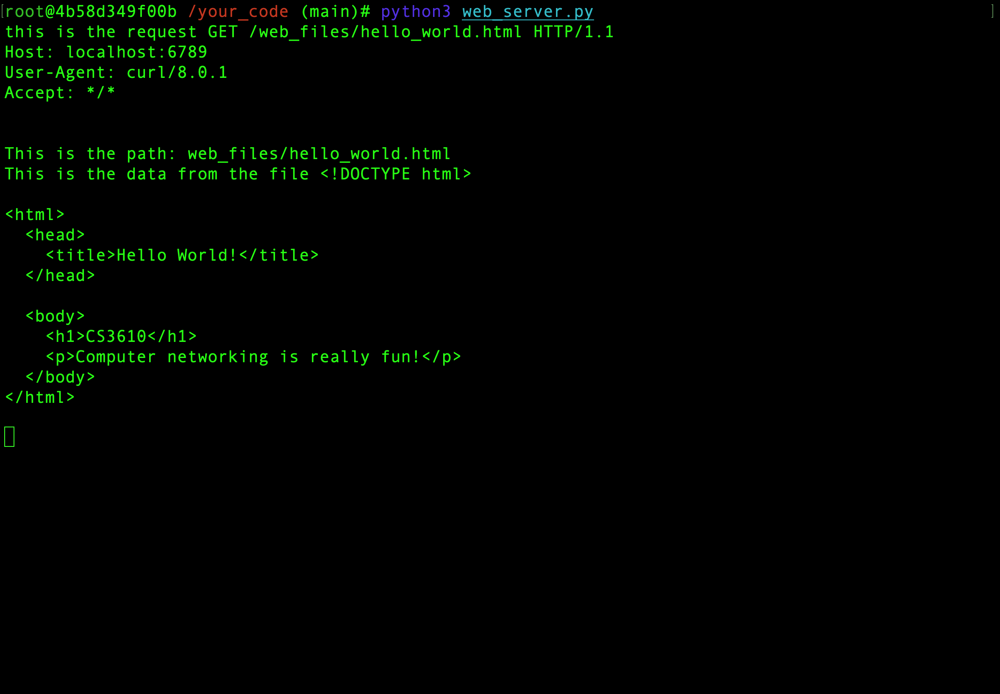

This is the info from print statements in the webserver after I called curl. 

This is the curl request to the client browser after the second command. 

I am runing your docker images and using two terminals. One to run the server and one to make requests on the docker containers localhost. 
