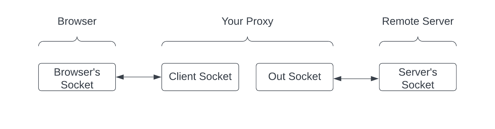

# PA02 - Simple TCP HTTP proxy

Implement a simple HTTP proxy, in python using TCP sockets.
This proxy should listen on `localhost:6789`.
Upon receiving a client,
it should accept the TCP connection,
receive any HTTP request it may have,
and forward it to the desired host in the "Host" field.
Then, it should forward the response back to the client.

So, the overall structure of the assignment is as follows:

The HTTP requests and responses should be unmodified by your proxy.

The proxy shoudl store incoming data,
until the remote server is done sending,
and then send it to the client all at once.
Use a timeout of 2 seconds.

## Working environment updates/notes
If you are not using a host Linux-like environemnt, or a full Linux VM, 
and want to use a container instead,
either on your machine, or on the campus linux machines,
then clone as follows:
`git clone --recurse-submodules git@...`
Then, see the `containers/` directory (a git sub-module).
https://git-scm.com/book/en/v2/Git-Tools-Submodules

## Deliverables

### proxy
`proxy.py`

This is the main file.
Running it runs the proxy server,
which will continue until the process is killed.

It has the following functions:
* `main`
	- Provided. Creates the proxy server socket, and calls `serve_client` whenever a client connects.
* `serve_client`
	- Serves a single request from a client. Sends the message to the remote host, gets the response with `receive_response`, and sends it to the client. It closes both sockets afterwards.
* `receive_response`
	- Receives from the remote host, returns it.
* `extract_hostname`
	- Returns the host name and the port for the HTTP header.

### iactuallytestedthis-proxy.png
`iactuallytestedthis-proxy.png`
A screenshot showing you actually tested your proxy with a browser and wireshark.

## Other
Configuring your browser to use the proxy:
* Firefox 
    - Go to Settings->General->Network Settings; 
    select "Manual Proxy" and set it to `localhost` on `6789` for HTTP.

* Qutebrowser
	- Execute `:set content.proxy http://localhost:6789/ `
    - or, use the GUI in qute://settings

Make sure your browser is not caching the page.
In qutebrowser, `Shift + r` will reload the page, discarding the cache. 

## Real-world application
You could easily run this code (or Docker image) on a remote machine,
and use it a proxy for your browser traffic!
This one is not encrypted, but you get the idea.
