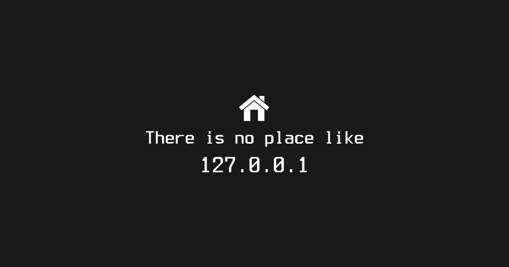

"Think Global, Code Local"
    - Me



# Programming Assignmeng 00 (pa00)
Get comfortable with a local development environment and version control.

# Part 1: Learn about shells
Actually read the following (in order):

0. https://taylor.git-pages.mst.edu/index_files/DataStructuresLab/Content/01-02-LinuxBash.html
1. https://ryanstutorials.net/linuxtutorial/
2. http://linuxcommand.org/lc3_learning_the_shell.php
3. https://doc.opensuse.org/documentation/leap/startup/html/book-opensuse-startup/part-bash.html (for more if you want; optional)
4. https://fishshell.com/docs/current/tutorial.html (this is the shell you have in the VM)

# Part 2: Learn about version control
Read the following (in order):

0. https://git-scm.com/videos (watch these videos)
1. https://taylor.git-pages.mst.edu/index_files/DataStructuresLab/Content/03-VersionControl.html
2. https://docs.gitlab.com/ce/gitlab-basics/start-using-git.html
3. https://about.gitlab.com/images/press/git-cheat-sheet.pdf
4. https://marklodato.github.io/visual-git-guide/index-en.html

# Part 3: Get your repository onto your machine
0. Basics 
    * Set up your VM (how to do so is in the class notes). 
    * In this lab, we assume you have read the bash lecture notes in detail, including reading and practicing the commands throughout the above tutorials.
1. In your VM OS, open Firefox, and log into https://git-classes.mst.edu using your MST credentials.
2. In git-classes, find the repository for lab00-environment, note the blue "clone" button/link; you want the https one, not the git@ one for now (unless you know what ssh keys are and how to use them).
3. In your class VM, open a terminal, and run these commands:
    ```sh
    cd
    tree 
    cd Classes/CS1500/
    git clone https://git-classes.mst.edu.....thelinkyoucopiedatthegitstepabove
    cd therepodirectoryyoujustcloned
    ```
    In case it was not clear, you need to replace parts of the commands above with information specific to you.
4. Open a second terminal, tile both open terminals next to each other, and in both, change directory into your newly clone repository folder.
    ```sh
    $ cd whateveryourfolderisnamed
    $ cd whateveryourfolderisnamed
    ```
    Use the command line only to complete parts 3 and 4 below! You will need to use a command line text editor like nano, vim, etc.
    Edit your program in one terminal, and run it in the other one!

# Part 4: Write a hello world Bash script
Write a basic shell script, `hello_shell.sh` in terminal 1:
```sh
nano hello_shell.sh
```

It should execute as follows in terminal 2:
```sh
bash hello_shell.sh
Enter your name:
Linus
Hello Linus
```
Where `Linus` was what you had to type interactively, after the running script printed "Enter your name:" to standard out.
Note: This script is basic enough that it should execute in either bash, zsh, fish, ksh, etc.
Hint: What if someone enters "Firstname Lastname"? Refer to my notes for more on the use of "" '' in bash!

Try to run this now:
```sh
bash grade.sh onlydothisaftercompletingthebasics
# And this to see debugging mode:
bash grade.sh
```

# Part 5: Write a basic Python3 program
Write a basic python script, `hello_python.py` in terminal 1:
```sh
nano hello_python.py
```

It should execute as follows in terminal 2:
```sh
python3 hello_python.py
Enter your name:
Linus
Hello Linus
```
Where `Linus` was what you had to type interactively, after the running script printed "Enter your name:" to standard out.
Note: you must use a function for the python script, and it must include a conditional main (to show you how unit testing works).
`def hello(input_name) -> str:`

Try to run this now:
```sh
bash grade.sh onlydothisaftercompletingthebasics
# And this to see debugging mode:
bash grade.sh
```

# Part 6: Think about redirection and diffs
Try capturing keyboard input and echoed output with your bash script:
```sh
echo "Linus Torvalds" >your_name.txt
cat your_name.txt
bash hello_shell.sh <your_name.txt
bash hello_shell.sh <your_name.txt >your_output_sh.txt
cat your_output_sh.txt
diff -y --color=always your_output_sh.txt your_output_given.txt
vim -d your_output_sh.txt your_output_given.txt 
# Type :q to exit vim
meld --dif your_output_sh.txt your_output_given.txt
```

Try it again with the python script:
```sh
echo "Linus Torvalds" >your_name.txt
cat your_name.txt
python3 hello_python.py <your_name.txt
python3 hello_python.py <your_name.txt >your_output_py.txt
cat your_output_py.txt
diff -y --color=always your_output_py.txt your_output_given.txt
vim -d your_output_py.txt your_output_given.txt 
# Type :q to exit vim
meld --dif your_output_py.txt your_output_given.txt
```

Try to run this now:
```sh
bash grade.sh onlydothisaftercompletingthebasics
# And this to see debugging mode:
bash grade.sh
```

# Part 7: Trace the python program
1. After you have finished the program, try tracing it two ways:
    First trace with pudb3:
    ```sh
    pudb3 hello_python.py
    ```
    Press ? to read about the shortcuts of pudb3.
    Use the arrow keys to navigate any menus that appear.
    Press n to "next line" through the program, one line at a time.
    Press q to quit or restart.

    Second, trace with spyder3:
    ```sh
    spyder3 hello_python.py
    ```
    Then, trace your python file in the Spyder IDE.
    Click help, read the whole Spyder tutorial!
    Then, click the debug menu, and debug. 
    Step through the program using the debug menu.

2. In the Windows host, or using VirtualBox itself, take a screenshot of you tracing the code with pudb3 and Spyder, named `tracing_pudb.png` and `tracing_spyder.png` where cApitALIzation matters... as it does with all these files.
    Move that screenshot to the repository directory. You can email it to yourself, use a shared folder, or upload it to the git repo using a web browser (watch out for the later option).

Try to run this now:
```sh
bash grade.sh onlydothisaftercompletingthebasics
# And this to see debugging mode:
bash grade.sh
```

# Part 8: Submit your work!
1. Finally, to submit all your work, it is time to manage these files you created within your Git repository. They must all be in the folder created when you cloned your Git repository.
    These commands should move your edits to the repository to the git-classes server:
    ```sh
    git add file1
    git add file2
    # where you do this for all your files
    git commit -m "Time to git committed to this ;)"
    git push -u origin master
    ```
    Read the resulting message Git prints!

2. Most importantly, to check all your previous Git-related steps worked, using the web browser in your host, navigate back to the repository, and confirm all the files you added are visible in the Gitlab web interface.
If the files are not visible, you will not be graded for them, and you should go ask for help!
To determine whether your project is finished:
    * First, in your VM, with a current working directory in the repository, run 
        ```sh
        bash grade.sh
        ```
        Read the output to determine how you did.
        Open the files in stdio_tests/diffs (actually look at these)!
        This just checks the files on your local machine.
    * Check out the git-classes Gitlab CI (details in the general syllabus). 
      If it turns green AND the details show a 100, then you're good! 
      If it's still red or you are less than 100, you need to fix your project.
      This test checks both that you got your files submitted correctly, and that your submission was correct!
