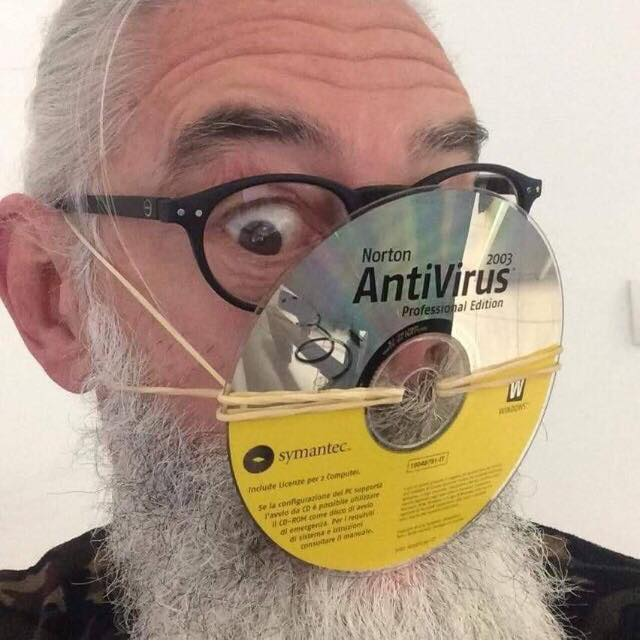
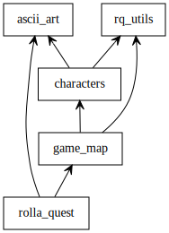
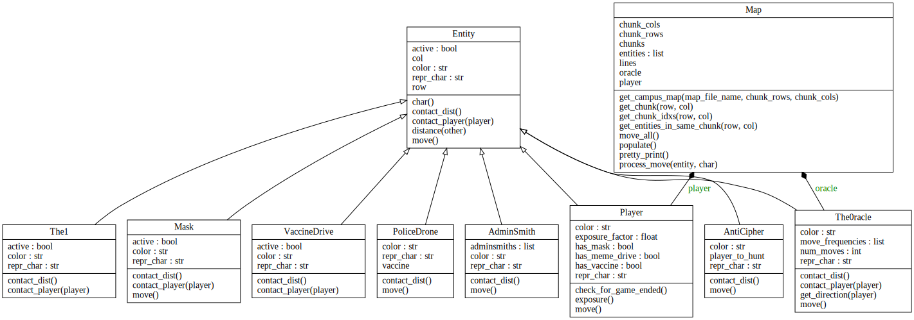

## CS 1500 Final Project - Rolla Quest III: The Zoom, Re-infected

### Intro
[Cinematic Version](https://starwarsintrocreator.kassellabs.io/#!/CMO5WpFCuliKL_tP28-8)

[My video introduction to the project](https://vimeo.com/488849820)

It has been nine months since the virulent disease, Continuous Online Videoconference Interdependence Delusions (COVID), has ravaged Missouri S&T.
The infectious agent behind this insidious disease is a bio-induced transmissible meme agent.
At first, this infection caused humorous and absurd behavior, like hoarding toilet paper, blaming 5G for viral infections, injecting chemical disinfectants, and popping malaria pills, but now symptoms have become much more grave, and COVID is no longer funny...
The campus is silent and foreboding, abandoned save for those who still foolishly cling to their desire for human interaction.
The departments of old have fallen.
Only the computer science majors, wise beyond their years, remain free from the ghastly touch of the virus.
Or, were the CS majors merely infected years ago by a similar weaker strain of the COVID, and are now immune?
Holed up in their dwellings, untouched even by sunlight, the CS students have been able to evade the virus.
A young computer scientist, George (a.k.a. the masked bandit), emerges from his dormitory unaware of the grim fate of his peers. 
Or was that just a dream, a simulation? 
With online everything, life feels surreal, and George can no longer discern simulation from reality.
While working on his biceps at the gym, George peers into the mirror, and notices a black cat walk behind him, but when he turns around, he can not find it!
He wondered, was the gym not shut down months ago?
Had George been Zoomed in too long, gotten lost in the virtual world, suffocated in his chinstrap mask, fallen into a COVID-induced coma, or some other unthinkable fate?
George heard a rumor that scientists at MST were working on a vaccine for this terrifyingly divisive disease, but that the experimental data had been lost, just as the key discovery had been made.
What will become of the university's last hope, or will the students be trapped in the Zoom, never to lear the virtual world?
Help George tear off his mask, escape the Zoom, and return to the human world!

### Playing the Game
You can play the game by running `python3 rolla_quest.py`.  
It is currenly playable, so give it a try now, before you get started!

The gameplay is as follows:
1. Search for a USB disk with the experimental data needed to create a meme-drive vaccine stored on it (behind Norwood Hall, TODO shrenk).
2. Pass the drive to the 0racle, to see if you can stop the bio-memetic disease, and escape this virtual box (behind the CS building).

You must also avoid anything that appears to be a person!
Getting too close to anyone (physically, emotionally, or otherwise...) will increase your "exposure factor".
If your exposure factor exceeds 1, you lose.
Fear not, as there are also items that can protect you from the virus.

### Deliverables
Much of the game has been written for you, and in fact is already playable.
You are primarily responsible for implementing the movement logic for the kinds of entities that can now be found on campus, namely:
* Vaccine drive (represented with a `V`)
* The1 (represented with a `1`)
* The0racle (represented with a `0`)
* AdministratorSmith (represented with a `S`)
* AntiCipher (represented with a `C`)
* PoliceDrone (represented with a `P`)
* Masks (represented with a `M`)
* ...and of course, George (The O.G. and first ever author and artist of Rolla Request I)! (represented with a `G`)

We give you the basic code, and all entities other than the George (the player) are stationary.  
This lack of movement is unrealistic, and what you need to fix and improve for your assignment.
All of the above entities inherit from a base `Entity` class, whose `move` function returns nothing (to indicate stationary movement).
You will be responsible for overriding this `move` function in child classes, to return a direction to move in, either North, South, East, West. 
Characters correspond to the movement directions, namely, up, left, down, and right.
You may also use wasd or vim-keybindings, if you prefer.
These `move` functions do not need to determine whether a move is valid or not, since a different part of the game's logic is responsible for that.
The movement logic you will implement for each character is as follows, listed in increasing order of difficulty.

**Hint**: Start with the easier logic first, then move on to the harder stuff!

#### Masks
There are some masks floating in the wind around campus.
Whether the masks have been used or not is unknown, but they're better than nothing, right?
To represent the random direction of the wind, these entities should move in a random direction.

#### AdministratorSmith
These characters profit from the Zoom, and want to trap your human lives within the Zoom!
Administrator Smiths are all about social hierarchies and socializing, especially with their own kind.
Thus, they seek out the nearest AdminSmith (other than themselves, of course) and will continue pursuing that AdminSmith until they come within 2 spaces of each other, after which their behavior will be analogous to that of the PoliceDrones and AntiCipher entities.

#### PoliceDrones
The Zoom realeses automated PoliceDrones to serve as sentinel patrols across campus, even using facial recognition, all to squash any resistance to the Zoom.
PoliceDrones are, of course, driven by their unyielding pursuit of the 0racle, but she is not defenseless!
When they near the 0racle, she can confuse their simple decision making, so they get forgetful, turning off their cameras, which they need for their AI facial recognition.
Thus, PoliceDroness will move in the direction of the 0racle, until they get within a radius of 4 spaces, in which case they are nearby, they will then move randomly.
If the random moves result in the PoliceDrone being more than four spaces away from the 0racle, then they will again directly pursue the 0racle.

#### AntiCiphers
Those opposing that which the Zoom is opposed to, are against what is good for people opposing the Zoom! 
Wait what, is that logic supposed to make sense? 
AntiCiphers don't like encryption, masks, math, or science, but worship the Zoom.
They are keen on spreading their message publically, and are not particularly fond of the social distancing guidelines set forth by the CDC.
For these reasons, the AntiCiphers will pursue you, George the masked bandit, until they are within a radius of 3 spaces from you, in which case their behavior will be analogous to that of the PoliceDrones when they enter the range of the 0racle, random.

#### 0racle 
The 0racle is a wise, enignatic, and elusive character, and she changes her strategy over time, for example when George takes a while to show up, when the PoliceDroness start to approach her.
The longer George takes to show up and deliver the meme-drive vaccine, the more nervous the 0racle gets.
The 0racle is too strategic to move toward or away from anything in particular, so she will move randomly, but according to the following logic:

Player Moves Made | 0racle Movement Frequency
--- | ---
0-49 | Once every 40 moves
50-99 | Once every 30 moves
100-149 | Once every 20 moves
150-199 | Once every 10 moves
200-249 | Once every 5 moves
250-299 | Once every 3 moves
300+ | Once every move

Once every "x" moves refers to the number of times the `0racle`'s `move` function is called.
For example, if the 0racle is to move once every 5 moves, the function should return the empty string (denoting no movement) the first 4 out of 5 times, and a random direction the fifth time.
Naturally, this erratic movement will make the 0racle harder for George to track down.
Fortunately, the 0racle has a pager that lets George know which direction to go in (bottom right of the display).
Complete the `0racle`'s `get_direction` function to return the appropriate cardinal/intercardinal direction (N, NE, E, etc) so the player knows which direction to go.  

All of the other entities have require some sort of tracking logic, so you will need to implement a `_move_to_follow` function in the `Entity` class that determines the move to be made if one wishes to follow/chase another `Entity`.

More details in `characters.py`.

### Code structure
Recall the class diagrams from the lectures on classes and OOP.
The package and class diagrams for this game is generated as follows:
`pyreverse -o svg *.py`

The basic structure of files:

And a detailed class diagram:

