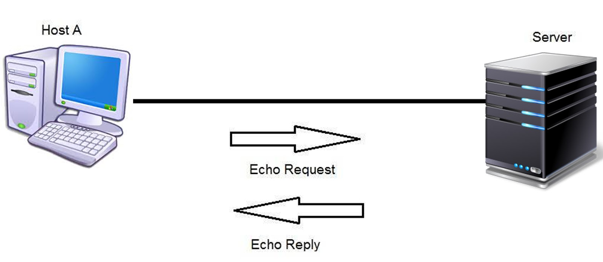

# PA03 - UDP echo server 



## Background
Read about ping: 
https://en.wikipedia.org/wiki/Ping_(networking_utility)

```bash
whatis ping
which ping
man ping
ping --help
ping 127.0.0.1
ping google.com
```

Enjoy learning about this entertaining ping gimick:
https://www.youtube.com/watch?v=JcJSW7Rprio

See https://www.rfc-editor.org/rfc/rfc792 section on echo request and reply:

Echo or Echo Reply Message
```
0                   1                   2                   3
0 1 2 3 4 5 6 7 8 9 0 1 2 3 4 5 6 7 8 9 0 1 2 3 4 5 6 7 8 9 0 1
+-+-+-+-+-+-+-+-+-+-+-+-+-+-+-+-+-+-+-+-+-+-+-+-+-+-+-+-+-+-+-+-+
|     Type      |     Code      |          Checksum             |
+-+-+-+-+-+-+-+-+-+-+-+-+-+-+-+-+-+-+-+-+-+-+-+-+-+-+-+-+-+-+-+-+
|           Identifier          |        Sequence Number        |
+-+-+-+-+-+-+-+-+-+-+-+-+-+-+-+-+-+-+-+-+-+-+-+-+-+-+-+-+-+-+-+-+
|     Data ...
+-+-+-+-+-
```

IP Fields:

Addresses

  The address of the source in an echo message will be the destination of the echo reply message.
  To form an echo reply message,
  the source and destination addresses are simply reversed,
  the type code changed to 0, and the checksum recomputed.

Type

  8 for echo message;

  0 for echo reply message.

Code

  0

Checksum

  The checksum is the 16-bit ones's complement,
  of the one's complement sum of the ICMP message,
  starting with the ICMP Type.
  For computing the checksum, the checksum field should be zero.
  If the total length is odd, 
  then the received data is padded with one octet of zeros,
  for computing the checksum.
  This checksum may be replaced in the future.

Identifier

  If code = 0, an identifier to aid in matching echos and replies, may be zero.

Sequence Number

 If code = 0, a sequence number to aid in matching echos and replies, may be zero.

   Description

      The data received in the echo message must be returned in the echo reply message.

      The identifier and sequence number may be used by the echo sender,
      to aid in matching the replies with the echo requests.
      For example, the identifier might be used like a port in TCP or UDP to identify a session,
      and the sequence number might be incremented on each echo request sent.
      The echoer returns these same values in the echo reply.

      Code 0 may be received from a gateway or a host.

If you forget about how echo requests work, just wait, it'll come back to you!

## Introduction
Ping uses IP-layer messages and raw sockets, 
so we won't program real ping yet.
That comes up in the next assignment!

This assignment both: 
1) gets you practice using UDP, and 
2) is background for the network layer (next assignment).
3) is a soft introduction to scapy.

You will refresh the basics of socket programming for UDP in Python,
including how to send and receive datagram packets using UDP sockets,
and also how to set a proper socket timeout.
You will gain familiarity with a application implementing `ping`,
and its usefulness in computing statistics such as packet loss rate.
The ping protocol allows a client machine to send a packet of data to a remote machine,
and have the remote machine return the data back to the client unchanged (an action referred to as echoing).
Among other uses, the ping protocol allows hosts to determine round-trip times to other machines.

You will first study a simple echo server written in Python,
and implement a corresponding client.
The functionality provided by these programs is similar to standard ping programs.
However, these programs use UDP to communicate with each other,
rather than the standard Internet Control Message Protocol (ICMP) within IP.

You are given the complete code for the echo server below.
Your task is to write the echo client.

## Provided files
`udp_echo_server.py` is already working, and is provided to you.

## Server Code
The given server code fully implements an echo server.
You do not need to modify this code.
In this server code, randomly some of the client's packets are simulated to be lost.
You should study this code carefully, as it will help you write your echo client.
The server sits in an infinite loop listening for incoming UDP packets.
When a packet comes in, the server simply sends it back to the client,
after waiting a random multiple of 10ms.

## Packet Loss and timing variability
UDP provides applications with an unreliable transport service.
Messages may get lost in the network,
due to router queue overflows, faulty hardware, or some other reasons.
Because packet loss is rare, or even non-existent, in local networks, 
the server in this lab injects artificial loss to simulate the effects of network packet loss.
The server creates a randomized integer variable,
which determines whether a particular incoming packet is lost or not.
You should use exception handling and catching of those exceptions to handle packet loss.
Further, the server introduces standardized delays.

## Part 1: basic python sockets

### Client Code
You need to implement the following client program.
The client should read 4 command line arguments and be run as follows:
```
python3 udp_echo_client.py <server hostname> <server port> <num pings> <timeout in sec>
```

`python3 udp_echo_client.py localhost 12000 10 3`
would be a valid way to run it.

Because UDP is an unreliable protocol, 
a packet sent from the client to the server may be lost in the network, or vice versa.
For this reason, the client cannot wait indefinitely for a reply to a ping message.
You should program the client to wait up to the timout argument in seconds for a reply; 
if no reply is received before the timeout,
your client program should assume that the packet was lost during transmission across the network.
To find out how to set the timeout value on a datagram socket,
you will need to look up the Python3 documentation for sockets.

### Specifically, your client program should
1. Send the ping message using UDP.
   Unlike TCP, you do not need to establish a connection first, 
   since UDP is a connectionless protocol.
2. Print the response message from server, if any.
3. Calculate and print the round trip time (RTT), 
   in seconds, of each packet, if server responses.
    * **For this, round the RTT to the nearest 10ms,
      both for display and for calculating statistics later,
      so things are consistent for the autograder.**
    * Display the time in ms with 0 decimal places.
4. Otherwise, print an error (see output files).
5. At the end, you will need to report the RTT statistics,
   at the end of all pings from the client.
   When you compute the time diff (start - current),
   round to two digits before converting to miliseconds.
   You can look at `custom_tests/goals/t1.out` for an example.

During development, you should run the server on your machine,
and test your client by sending packets to localhost (or, 127.0.0.1).
After you have fully debugged your code,
you could see how your application communicates across the network,
with the ping server and ping client running on different virtual machines.

### Message Format
The ping messages in this lab are formatted in a simple way,
given in the code, something like this:
```py
message = f"PING {SERVER_HOSTNAME} ({SERVER_IP}) {PING_NUM} {time.asctime()}"
```
Note: start counting your `PING_NUM` at 1.

### Random things to watch out for
Watch out for off-by-one errors with size.
Think about the numbe of times you call the time function.

## Part 2: Scapy version
Learn the basics of python3-scapy by reading the following:
* https://scapy.readthedocs.io/en/latest/
* https://github.com/0xbharath/art-of-packet-crafting-with-scapy
* https://github.com/secdev/scapy 
  (section of README.md called "Resources" has a couple iPython notebook tutorials)
* In general, if you want to spoof packets, write network utilities, etc., 
  scapy is better to try before raw sockets.

You will also write a another version of the client,
but instead of of using `socket.`, you will use `scapy` and basic python only.

## Deliverables
Submit these files/edits:
* `udp_echo_client.py`
    * The echo client.
* `udp_echo_client_scapy.py`
	* A similar version, that should produce roughly the same thing!
    * Given timing variability, calculate the time difference with 1 digit,
      instead of 2, as in the echo client that uses sockets.
* `iactuallytestedthis-udp_echo.png` which contains an image of you testing your code.
* `report.md` which includes markdown-embedded images documenting how you ran your code,
   and what success looked like, along with any brief notes you want me to know.
* You will hand in the complete client code,
  and screenshots at the client verifying that your echo program works as required.

## Final notes
I hope you have a resounding success with this assignment...
