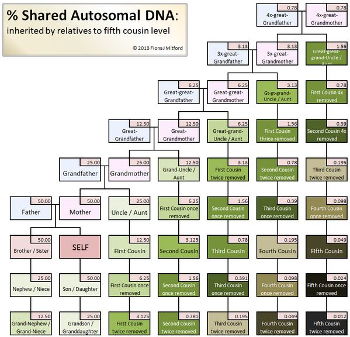
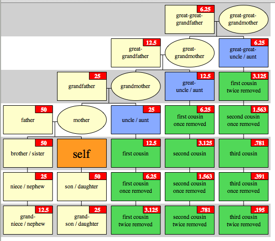
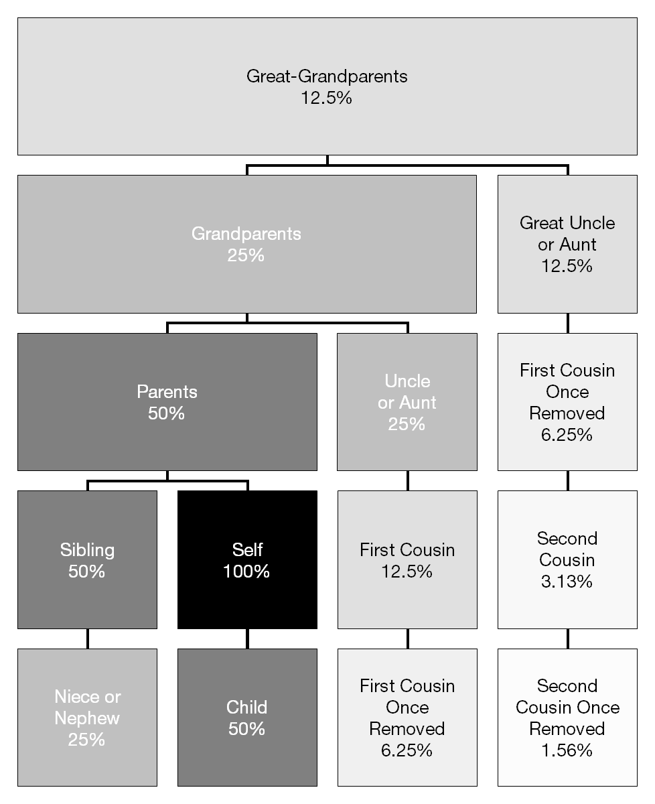
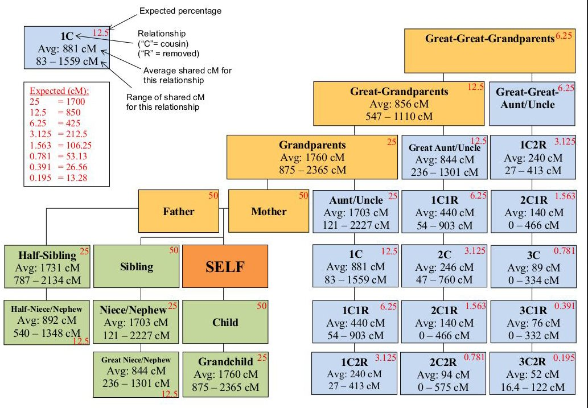
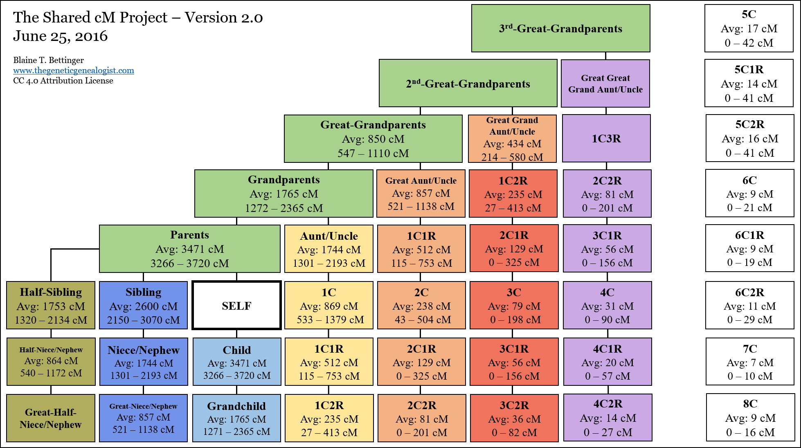

## Global and multiple sequence alignment exercises
It's time to practice some of the tools we've covered, including:
aligning sequences, progressive multiple-sequence alignment, and phylogenetic reconstruction.
You will also learn some about DNA profiling and human genetics:

* https://en.wikipedia.org/wiki/DNA_profiling
* https://en.wikipedia.org/wiki/Microsatellite
* https://en.wikipedia.org/wiki/Minisatellite
* https://en.wikipedia.org/wiki/DNA_paternity_testing

I have given you a set of sequences from a family of individuals.
Your job is to use a form of DNA profiling, to tell me their family relationships.
The DNA sequences are from the same part of the genome,
and thus can be globally aligned.
Being of the same species,
they share the vast majority of their DNA.
However, they contain some limited hyper-variable regions,
so we can't just compute percentage similarity.
These hypervariable regions are called microsatellites,
that may differ much more across individuals than most of the genome,
though predictably less between family members.
You should use progressive global multiple sequence alignment.
Progressive MSA can help indentify which segments of the DNA sequences are conserved, and thus identical.
This could tell you which segments are hypervariable.
You could then use the hypervariable regions to determine family relationships.

Alternatively, you could hack the PRNG, but that will most certainly be harder...

Alternatively, you could peek at the key file, but that will most certainly be cheating...

Running global MSA on this one may take a while (~15-30 minutes per 1000bp sequence),
which is just big enough that you can't convieniently pairwise align all family members ($n^2$ alignments).
Instead you need to use the MSA methods with a guide tree (log n).

Hint:
This is a basic statistical principle.
Does sharing 50% of genes mean 50% of bases?
With two totally random sequences,
what percentage of aligned bases are shared by chance alone?
If you share 50% of genes, 
what percentage of aligned bases are shared?

## FASTA
* http://www.bioinformatics.nl/tools/crab_fasta.html
* https://en.wikipedia.org/wiki/FASTA_format
